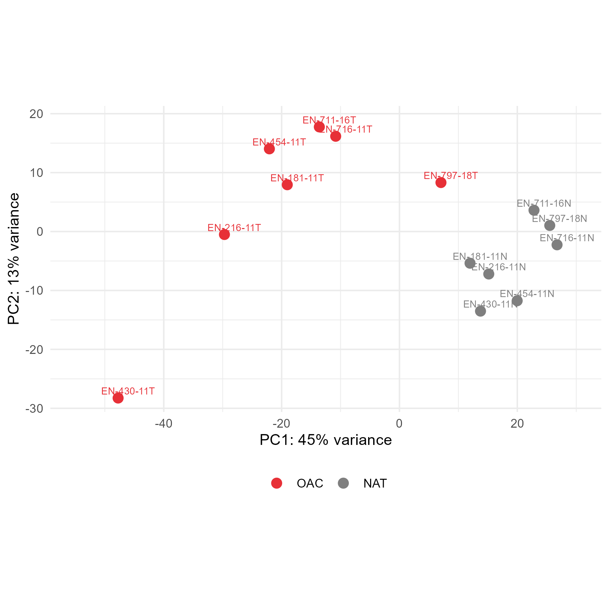
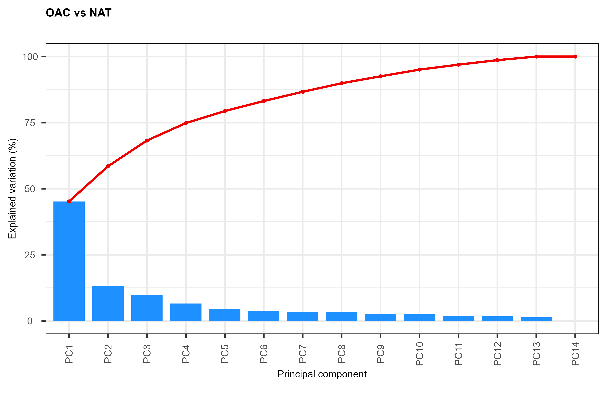

Last Updated on 2024-08-20

# Supplementary Material

This repository contains the supplementary information for:
**Comparative analysis of proteomic expression between oesophageal
adenocarcinoma and normal adjacent tissue**.

This comprises of the materials and methods as a `pdf` and tables as
`csv` files.

The column names and contents of the `csv` files in the `tables` folder
are described below.

## Figure S1 - Principal Component Analysis

<figure>

<figcaption aria-hidden="true">Scree plot</figcaption>
</figure>

## Patient Information

Table S1 contains the patient information for the 7 male donors in this
study.

                      File                                  
                    ────────────────────────────────────────
                      Table-S1-OAC-Patient-Information.csv  
                    ────────────────────────────────────────

Column names: File

| Column name          | Description                 |
|----------------------|-----------------------------|
| `donor_id`           | Donor identifier            |
| `age_at_diagnosis`   | Age of patient at diagnosis |
| `sex`                | Sex of patient              |
| `location_of_tumour` | Location of tumour          |
| `treatment_modality` | Treatment modality          |

Patient information

## Peaks normalised Top 3 peptide intensities

Label free quantification using the Peaks Q module of Peaks Studio
\[[1](#ref-zhang2012),[2](#ref-lin2013)\] yielding matrices of protein
identifications as quantified by their normalised top 3 peptide
intensities.

Tables S2 contain normalised top 3 peptide intensities.

           File                                                        
         ──────────────────────────────────────────────────────────────
           Table-S2-OAC-Peaks-Normalised-Top3-Peptide-Intensities.csv  
         ──────────────────────────────────────────────────────────────

Column names: File

| Column name | Description |
|-----------------------------------------------|-------------------------|
| `protein` | protein short name |
| `gene` | HGNC gene symbol |
| `sample_id` the donor id or donor id suffixed with `T` for tumour or `N` for NAT samples | Normalised top 3 peptide intensity from Peaks |

Peaks normalised top 3 peptide intensities Table information

## Differential protein expression with DEqMS

The normalised top 3 peptide intensities were filtered to remove any
proteins for which there were more than two missing values across the
samples. Differential protein expression (DEP) was then calculated with
DEqMS using the default steps \[[3](#ref-deqms)\].

Tables S3 contain the output of DEqMS.

                         File                            
                       ──────────────────────────────────
                         Table-S3-OAC-DEqMS-Results.csv  
                       ──────────────────────────────────

Column names: File

| Column name    | Description                                    |
|----------------|------------------------------------------------|
| `logFC`        | log2 fold change between two groups            |
| `AveExpr`      | the mean of the log2 ratios across all samples |
| `t`            | Limma t-values                                 |
| `P.Value`      | Limma p-values                                 |
| `adj.P.Val`    | BH method adjusted Limma p-values              |
| `B`            | Limma B values                                 |
| `gene`         | HGNC gene symbol                               |
| `count`        | peptide count values                           |
| `sca.t`        | DEqMS t-statistics                             |
| `sca.P.Value`  | DEqMS p-values                                 |
| `sca.adj.pval` | BH method adjusted DEqMS p-values              |
| `protein`      | protein short name                             |

DEqMS Table information

## Functional analysis with g:Profiler

Functional enrichment analysis used g:Profiler \[[4](#ref-kolberg2020)\]
using default settings for homo sapiens modified to exclude GO
electronic annotations. Protein identifiers were used as inputs for
DEPs.

Tables S4 contain the g:Profiler outputs.

                       File                                
                     ──────────────────────────────────────
                       Table-S4-OAC-gProfiler-Results.csv  
                     ──────────────────────────────────────

Column names: File

<table>
<caption>g:Profiler Table information</caption>
<colgroup>
<col style="width: 15%" />
<col style="width: 84%" />
</colgroup>
<thead>
<tr class="header">
<th>Column name</th>
<th>Description</th>
</tr>
</thead>
<tbody>
<tr class="odd">
<td><code>query</code></td>
<td>the name of the input query</td>
</tr>
<tr class="even">
<td><code>significant</code></td>
<td>indicator for statistically significant results</td>
</tr>
<tr class="odd">
<td><code>p_value</code></td>
<td>hypergeometric p-value after correction for multiple testing</td>
</tr>
<tr class="even">
<td><code>term_size</code></td>
<td>number of genes that are annotated to the term</td>
</tr>
<tr class="odd">
<td><code>query_size</code></td>
<td>number of genes that were included in the query</td>
</tr>
<tr class="even">
<td><code>intersection_size</code></td>
<td>the number of genes in the input query that are annotated to the
corresponding term</td>
</tr>
<tr class="odd">
<td><code>precision</code></td>
<td>the proportion of genes in the input list that are annotated to the
function (defined as intersection_size/query_size)</td>
</tr>
<tr class="even">
<td><code>recall</code></td>
<td>the proportion of functionally annotated genes that the query
recovers (defined as intersection_size/term_size)</td>
</tr>
<tr class="odd">
<td><code>term_id</code></td>
<td>unique term identifier</td>
</tr>
<tr class="even">
<td>
<code>source</code>

<code>term_name</code>
</td>
<td>the abbreviation of the data source for the term (e.g. GO:BP)</td>
</tr>
<tr class="odd">
<td><code>effective_domain_size</code></td>
<td>the total number of genes “in the universe” used for the
hypergeometric test</td>
</tr>
<tr class="even">
<td><code>source_order</code></td>
<td>numeric order for the term within its data source</td>
</tr>
<tr class="odd">
<td><code>parents</code></td>
<td>list of term IDs that are hierarchically directly above the term.
For non-hierarchical data sources this points to an artificial root
node.</td>
</tr>
<tr class="even">
<td><code>evidence_codes</code></td>
<td>a lists of all evidence codes for the intersecting genes between
input and the term. The evidences are separated by comma for each
gene.</td>
</tr>
<tr class="odd">
<td><code>intersection</code></td>
<td>a comma separated list of genes from the query that are annotated to
the corresponding term</td>
</tr>
</tbody>
</table>

g:Profiler Table information

## References

1.
Zhang J, Xin L, Shan B, Chen W,
Xie M, Yuen D, et al. PEAKS DB: De novo sequencing assisted database
search for sensitive and accurate peptide identification. Molecular &
Cellular Proteomics. 2012;11: M111010587. 

2.
Lin H, He L, Ma B. A combinatorial
approach to the peptide feature matching problem for label-free
quantification. Bioinformatics. 2013;29: 1768–1775.
doi:[10.1093/bioinformatics/btt274](https://doi.org/10.1093/bioinformatics/btt274)

3.
DEqMS. Available:
<http://bioconductor.org/packages/DEqMS/>

4.
Kolberg L, Raudvere U, Kuzmin I,
Vilo J, Peterson H. gprofiler2 – an R package for gene list functional
enrichment analysis and namespace conversion toolset g:Profiler.
F1000Research. 2020;9: 709.
doi:[10.12688/f1000research.24956.2](https://doi.org/10.12688/f1000research.24956.2)
